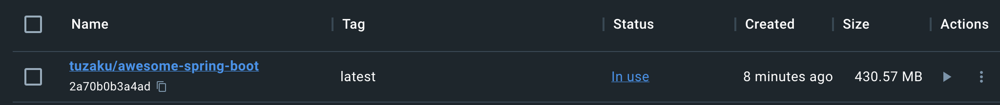

# AwesomeSpringBoot

Spring Boot pratice with lots of technologies

# Swagger local

http://localhost:9010/asb/swagger-ui.html

Sign in using accounts: admin/1111, att/1111, storemg/1111, bookmg/1111

# How to use

## Run local without docker

- First, run Redis if bean TokenStore using `RedisTokenStore` instead of `InMemoryTokenStore`
- Then, get access token via this API: http://localhost:9010/boot-tech/signin. All default accounts (in first run using flyway) have password = "1111"
- Use acccess token to call APIs

## Run local using docker

Ta cần tạo container MySQL trước, tạo cả volume và network cho nó, rồi mới tạo container cho spring app dùng chung network vừa tạo

- Create volume for MySQL
  ```
  docker volume create asb_mysql_data
  docker volume create asb_mysql_config
  ```
- Create network for MySQL: `docker network create asb_mysqlnet`
- Run MySQL in a container and attach to the volumes and network we created above
  ```
  docker run -it --rm -d -v asb_mysql_data:/var/lib/mysql \
  -v asb_mysql_config:/etc/mysql/conf.d \
  --network asb_mysqlnet \
  --name asb_mysqlserver \
  -e MYSQL_USER=asb -e MYSQL_PASSWORD=asb1111 \
  -e MYSQL_ROOT_PASSWORD=root -e MYSQL_DATABASE=asb \
  -p 3307:3306 mysql:8.0
  ```
  Now, in Spring config, we need to connect to `asb_mysqlserver` instead of `localhost:3306`. View [application-docker.yml](./src/main/resources/application-docker.yml) for more detail
- Build image (if you want to remove previous build, run `docker image rm asb:1.0.0` first), note the dot at the and of the file, which denotes the current folder: `docker build --tag asb:1.0.0 .`
- Run container, also attach to the network we created above:
  ```
  docker run --rm -d \
  --name asb_server \
  --network asb_mysqlnet \
  -p 9010:9010 asb:1.0.0
  ```

Done rồi đó, check thử image vừa được tạo:

```bash
➜  awesome-spring-boot git:(master) ✗ docker images
REPOSITORY                                 TAG           IMAGE ID       CREATED         SIZE
asb                                        1.0.0         54c857f8b2af   4 minutes ago   369MB
mysql                                      8.0           fe893ca74649   7 days ago      592MB
```

Ta thấy có image của backend và của mysql. Check thử containers xem:

```bash
➜  awesome-spring-boot git:(master) ✗ docker ps
CONTAINER ID   IMAGE          COMMAND                  CREATED             STATUS             PORTS                               NAMES
41636579026b   asb:1.0.0      "./mvnw spring-boot:…"   6 minutes ago       Up 6 minutes       0.0.0.0:9010->9010/tcp              asb_server
e8b77575bbb9   mysql:8.0      "docker-entrypoint.s…"   About an hour ago   Up About an hour   33060/tcp, 0.0.0.0:3307->3306/tcp   asb_mysqlserver
```

Giờ vào swagger mà xem. Thử upload rồi download file xem có được ko. Đầu tiên phải login để lấy access token (acc nào cũng được), sau đó test api upload. Vào bên trong container để xem có upload được ko (note: dấu `#` là đang dùng account `root` nhé):

```bash
➜  awesome-spring-boot git:(master) ✗ docker exec -it 41636579026b /bin/sh
# pwd
/app
# ls -la
total 44
drwxr-xr-x 1 root root  4096 Jun  1 09:07 .
drwxr-xr-x 1 root root  4096 Jun  1 09:06 ..
drwxr-xr-x 2 root root  4096 Jun  1 09:07 asb-upload
drwxr-xr-x 3 root root  4096 Jun  1 06:48 .mvn
-rwxr-xr-x 1 root root 10284 May 31 17:34 mvnw
-rw-r--r-- 1 root root  6455 May 31 16:03 pom.xml
drwxr-xr-x 4 root root  4096 Jun  1 09:06 src
drwxr-xr-x 7 root root  4096 Jun  1 09:06 target
# cd asb-upload
# ls -la
total 1324
drwxr-xr-x 2 root root    4096 Jun  1 09:07 .
drwxr-xr-x 1 root root    4096 Jun  1 09:07 ..
-rw-r--r-- 1 root root 1344144 Jun  1 09:07 IMG_7921_1685610467081.JPG
```

Oke, vậy là upload được rồi

Ref: https://docs.docker.com/language/java/build-images/

## Run local using docker compose

Create a Compose file to start our development container and the MySQL database using a single command.

Then, run following command is enough: `docker-compose -f docker-compose.dev.yml up --build`

Ref: https://docs.docker.com/language/java/develop/

# Configure CI/CD dùng Github actions

Có thể vào tab Actions trên github repo, rồi làm theo hướng dẫn, hoặc vào trang docs của docker để xem (linh ref ở dưới) cụ thể:

- Đầu tiên vào docker hub, login xong lấy access token
- Tiếp theo vào github repo > Settings > Secrets and variables > Actions
- Tạo 2 biến sau:
  - `DOCKERHUB_USERNAME`: username của bạn, ex: `tuzaku`
  - `DOCKERHUB_TOKEN`: access token vừa tạo ở trên
- Create action trên Github (vào tab action rồi search sẽ thấy), hoặc tạo file `docker-image.yml` rồi push lên cũng đc
- Tạo nội dung file yml giống như trang docs.docker hướng dẫn, cụ thể:

  ```yml
  name: Docker Image CI

  on:
    push:
      branches: ["master"]
    pull_request:
      branches: ["master"]

  jobs:
    build:
      runs-on: ubuntu-latest
      steps:
        - name: Checkout
          uses: actions/checkout@v3
        - name: Login to Docker Hub
          uses: docker/login-action@v2
          with:
            username: ${{ secrets.DOCKERHUB_USERNAME }}
            password: ${{ secrets.DOCKERHUB_TOKEN }}
        - name: Set up Docker Buildx
          uses: docker/setup-buildx-action@v2
        - name: Build and push
          uses: docker/build-push-action@v4
          with:
            context: .
            target: development
            file: ./Dockerfile
            push: true
            tags: ${{ secrets.DOCKERHUB_USERNAME }}/awesome-spring-boot:latest
  ```

- Commit là xong. Sau khi commit và build action xong, vào docker hub sẽ thấy image vừa đc push lên rỏi đó: https://hub.docker.com/repository/docker/tuzaku/awesome-spring-boot/general
- Pull cái image này về thử xem: `docker pull tuzaku/awesome-spring-boot`:

  ```
  tahuyen@MacBook-Pro-cua-TA ~ % docker pull tuzaku/awesome-spring-boot
  Using default tag: latest
  latest: Pulling from tuzaku/awesome-spring-boot
  9d19ee268e0d: Pull complete
  8a1d9603a222: Pull complete
  40550a0c5d13: Pull complete
  031298b013cc: Pull complete
  997b6eda5add: Pull complete
  b6575dd9b707: Pull complete
  83ad0640e201: Pull complete
  8ee75f831473: Pull complete
  07c6f90b3a6f: Pull complete
  cc17a7b15e54: Pull complete
  Digest: sha256:74f505efba68b05ea2283766fde3dc645dac5186fc96c9b1bfdc4edc95413677
  Status: Downloaded newer image for tuzaku/awesome-spring-boot:latest
  docker.io/tuzaku/awesome-spring-boot:latest

  What's Next?
    View summary of image vulnerabilities and recommendations → docker scout quickview tuzaku/awesome-spring-boot
  ```

- Nó nặng tận 430MB
  
- Ấn run thử thì lỗi!!! Do ko tìm thấy server MySQL này: `asb_mysqlserver`
  ```
  2023-08-16 21:38:23 Caused by: java.net.UnknownHostException: asb_mysqlserver: Name or service not known
  2023-08-16 21:38:23     at java.net.Inet4AddressImpl.lookupAllHostAddr(Native Method)
  2023-08-16 21:38:23     at java.net.InetAddress$2.lookupAllHostAddr(InetAddress.java:867)
  2023-08-16 21:38:23     at java.net.InetAddress.getAddressesFromNameService(InetAddress.java:1302)
  2023-08-16 21:38:23     at java.net.InetAddress$NameServiceAddresses.get(InetAddress.java:815)
  2023-08-16 21:38:23     at java.net.InetAddress.getAllByName0(InetAddress.java:1291)
  2023-08-16 21:38:23     at java.net.InetAddress.getAllByName(InetAddress.java:1144)
  2023-08-16 21:38:23     at java.net.InetAddress.getAllByName(InetAddress.java:1065)
  2023-08-16 21:38:23     at com.mysql.cj.protocol.StandardSocketFactory.connect(StandardSocketFactory.java:132)
  2023-08-16 21:38:23     at com.mysql.cj.protocol.a.NativeSocketConnection.connect(NativeSocketConnection.java:65)
  2023-08-16 21:38:23     ... 38 common frames omitted
  2023-08-16 21:38:23 [INFO] ------------------------------------------------------------------------
  2023-08-16 21:38:23 [INFO] BUILD FAILURE
  2023-08-16 21:38:23 [INFO] ------------------------------------------------------------------------
  2023-08-16 21:38:23 [INFO] Total time:  32.996 s
  2023-08-16 21:38:23 [INFO] Finished at: 2023-08-16T14:38:23Z
  ```
- Túm lại việc tạo action này đã build và push thành công image dựa theo `Dockerfile` lên docker hub rồi, nhưng có lẽ image này ko tự chạy đc, cần chạy image mysql trc...

Ref: https://docs.docker.com/language/java/configure-ci-cd/ (Note: this ref link is not entirely identical to what GitHub guides)

# Technologies are used

- Swagger
- Flyway
- JPA/Hibernate
- Lombok
- jxls
- Spring Security, OAuth2
- RESTful API

# Setup https

- Using this command to generate keystore (with PKCS12 format):

```
keytool -genkeypair -alias tuzaku -keyalg RSA -keysize 2048 -storetype PKCS12 -keystore keystore.p12 -validity 3650 -storepass tzk@20200923
```

# Refs:

- https://www.thomasvitale.com/https-spring-boot-ssl-certificate/
- https://www.baeldung.com/rest-api-search-language-spring-data-querydsl
- https://www.baeldung.com/spring-security-integration-tests

# JPA rất ngu!

## KHÔNG dùng được JpaRepository với class ko phải entity

Nếu dùng:

```java
public interface BookRepository extends JpaRepository<Book, Integer>
```

Thì `class Book` phải là 1 entity (`@Entity`)

Dùng query map sang object ko phải entity thì KHÔNG được:

```java
 @Query(nativeQuery = true,
        value = "SELECT "
                + "    b.id, "
                + "    b.title, "
                + "    b.author, "
                + "    b.price, "
                + "    b.created_date, "
                + "    b.modified_date, "
                + "    GROUP_CONCAT(c.id SEPARATOR ';') AS category_id_str, "
                + "    GROUP_CONCAT(c.name SEPARATOR ';') AS category_name_str "
                + "FROM book b "
                + "LEFT JOIN book_category bc "
                + "    ON b.id = bc.book_id "
                + "INNER JOIN category c "
                + "    ON bc.category_id = c.id "
                + "GROUP BY b.id "
                + "ORDER BY b.id",
        countQuery = "SELECT count(id) FROM book")
Page<BookDetail> getBookDetails(Pageable pageable);
```

(Giả sử như có class BookDetail với các field tương ứng với các cột trong query trên! Vẫn KHÔNG dùng được!)

Tất nhiên có cách, chẳng hạn dùng `@NamedNativeQuery` và `@SqlResultSetMapping`, nhưng trông chả đẹp mắt tý nào!!! Tham khảo các link bên dưới

Ref:

- https://stackoverflow.com/questions/55513776/create-spring-repository-without-entity
- https://stackoverflow.com/questions/29082749/spring-data-jpa-map-the-native-query-result-to-non-entity-pojo
- https://stackoverflow.com/questions/64762080/how-to-map-sql-native-query-result-into-dto-in-spring-jpa-repository

## KHÔNG select được cột @Transient

Giả sử 1 Entity có cột:

```java
@Transient
private String categoryIdStr;
```

Thì query cột đó, data vẫn null!

```java
@Query(nativeQuery = true,
        value = "SELECT "
                + "    b.id, "
                + "    b.title, "
                + "    b.author, "
                + "    b.price, "
                + "    b.created_date, "
                + "    b.modified_date, "
                + "    GROUP_CONCAT(c.id SEPARATOR ';') AS category_id_str, "	// NULL!
                + "    GROUP_CONCAT(c.name SEPARATOR ';') AS category_name_str "
                + "FROM book b "
                + "LEFT JOIN book_category bc "
                + "    ON b.id = bc.book_id "
                + "INNER JOIN category c "
                + "    ON bc.category_id = c.id "
                + "GROUP BY b.id "
                + "ORDER BY b.id",
        countQuery = "SELECT count(id) FROM book")
Page<Book> getBookDetails(Pageable pageable);
```

## Last pagination JPA doesn't call count query

Thật vậy, nếu có 1 API phân trang, giả sử totalRow = 34, pageSize = 10, tức là có 4 page. Thì page cuối cùng (pageNum=3 & pageSize=10) nó sẽ ko gọi countQuery nữa! (Đã test với trường hợp `nativeQuery = true`). Có lẽ nó tự tính được totalRow, tính dễ mà! Một sự tối ưu nho nhỏ!
